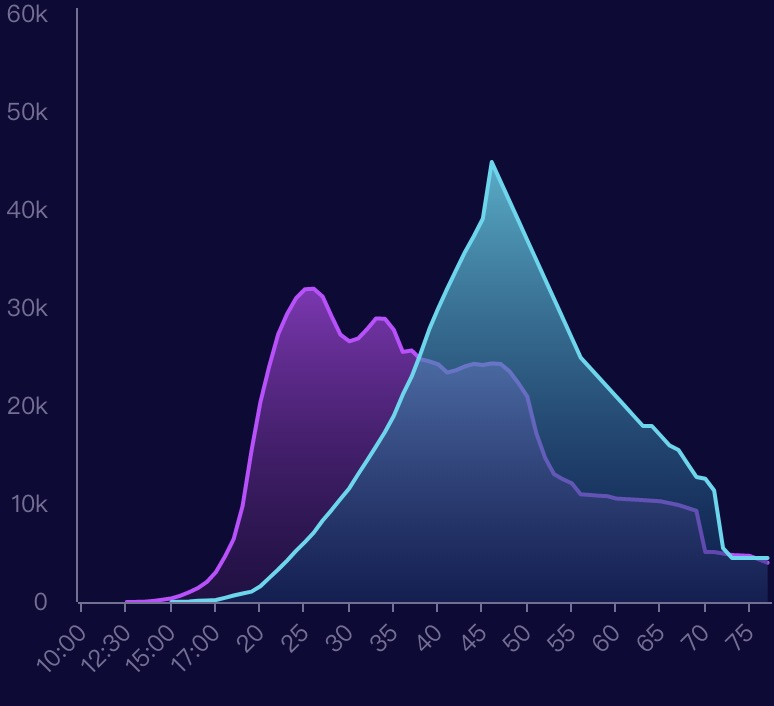
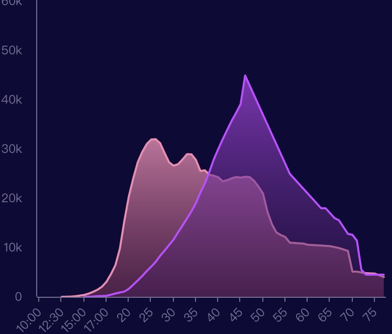
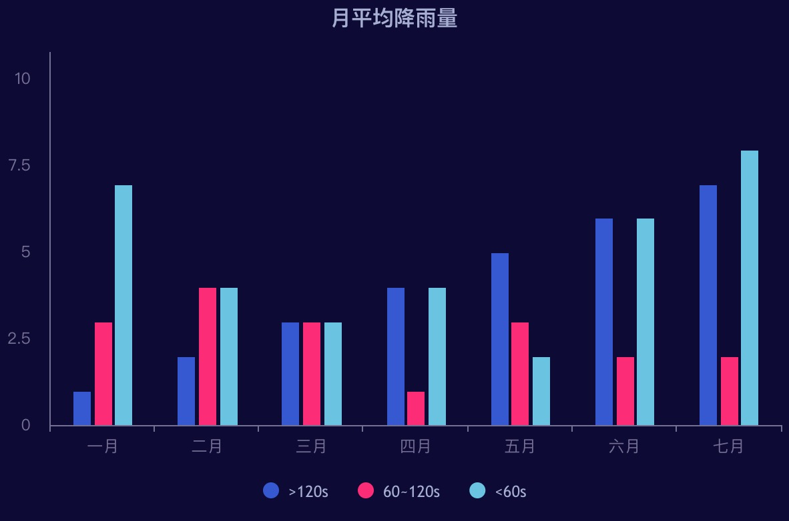

## 使用说明

##### react-highcharts
```
import beautyHighcharts from 'react-beauty-highcharts';
const ReactHighcharts = require('react-highcharts'); 

let config = beautyHighcharts.doubleLine()
config.series[0].data =[
      369, 640, 1005, 1436, 2063, 3057, 4618, 6444, 9822, 15468,
      20434, 24126, 27387, 29459, 31056, 31982, 32040, 31233, 29224, 27342,
      26662, 26956, 27912, 28999, 28965, 27826, 25579, 25722, 24826, 24605,
      24304, 23464, 23708, 24099, 24357, 24237, 24401, 24344, 23586, 22380,
      21004, 17287, 14747, 13076, 12555, 12144, 11009, 10950, 10871, 10824,
      10577, 10527, 10475, 10421, 10358, 10295, 10104, 9914, 9620, 9326,
      5113, 5113, 4954, 4804, 4761, 4717, 4368, 4018
    ]
    config.series[1].data =[
      5, 25, 50, 120, 150, 200, 426, 660, 869, 1060,
      1605, 2471, 3322, 4238, 5221, 6129, 7089, 8339, 9399, 10538,
      11643, 13092, 14478, 15915, 17385, 19055, 21205, 23044, 25393, 27935,
      30062, 32049, 33952, 35804, 37431, 39197, 45000, 43000, 41000, 39000,
      37000, 35000, 33000, 31000, 29000, 27000, 25000, 24000, 23000, 22000,
      21000, 20000, 19000, 18000, 18000, 17000, 16000, 15537, 14162, 12787,
      12600, 11400, 5500, 4512, 4502, 4502, 4500, 4500
    ]
render() {
    <ReactHighcharts config ={config}></ReactHighcharts>
}
```


pink粉色
```
let config = beautyHighcharts.doubleLine(['pink'])
```


columns
```
import beautyHighcharts from 'react-beauty-highcharts';

let config = beautyHighcharts.columns()

```


